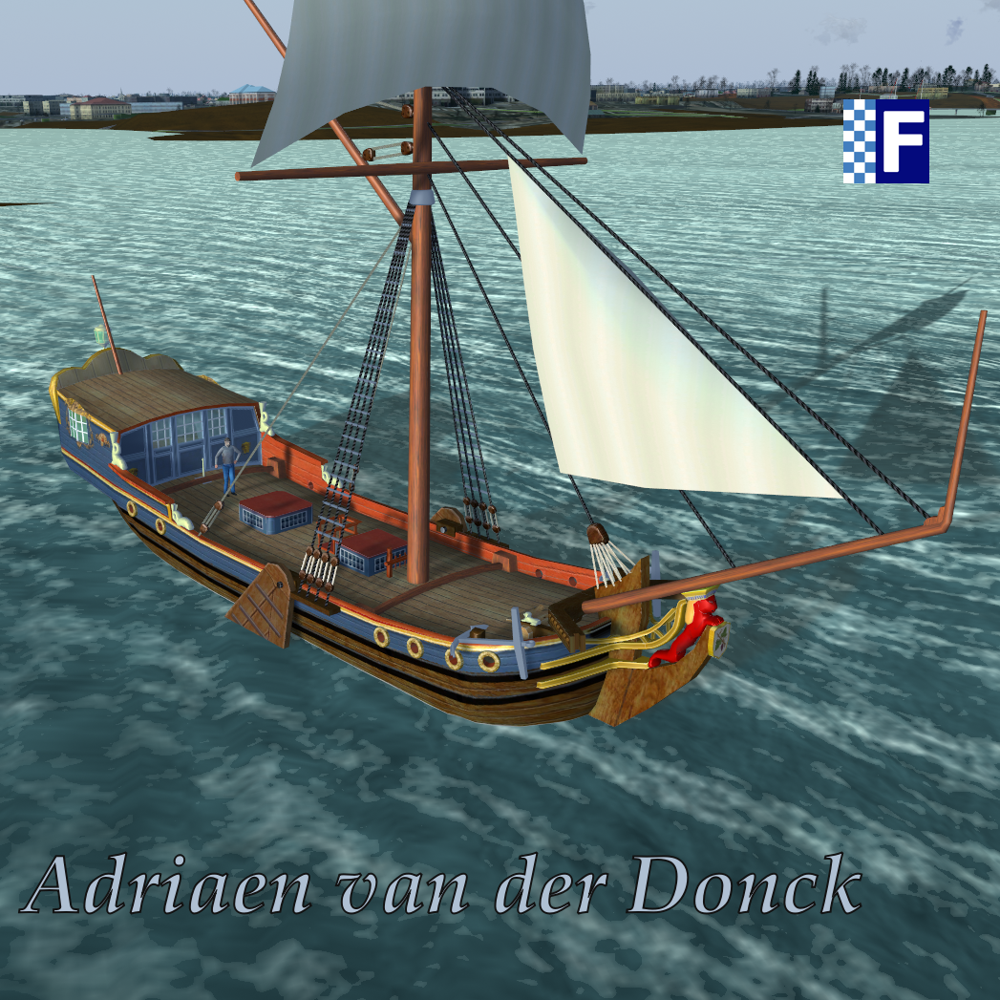

# Donck

This is an attempt to recreate a Dutch statenjacht *Adriaen van der Donck* in FlightGear.

## Current State

This project is another sandbox for me to learn the ins-and-outs of Flightgear development and play in the virtual water. Don't expect a professional level experience! The *Adriaen van der Donck* serves two purposes: 1) to further develop different types of sails (square sails *vs.* fore-and-aft); 2) to experiment with various shaders to import more realistic representation of local waves.

The project is a work in progress and not under active development.

The current state includes a 'Gerstner' wave vertex shader which animates a localized water grid. Up to 4 separate waves can be defined by setting direction, amplitude, frequency, steepness and speed for each wave. These parameters can be set through a Canvas GUI by pressing cntl-w. The waves are visible only if amplitude is greater than zero and they are best observed in wire-frame mode. Note that further development of the shader is needed. This is particularly apparent when a wave reaches an amplitude/steepness where--in the physical world--the wave would break.

Other work to be done includes:

1) Re-implement the boat's motion in accordance with the waves. This is currently broken and the Donck does not react to any waves;

2) Implement a fragment shader to give the waves the appearance of water. Currently, there is a place-holder shader which simply creates a blue to white color gradation based on amplitude;

3) A method to assign transparency to (or rendering order of) the default FlightGear water surface needs to be developed. Currently, the flat default FGFS water bisects the animated water obscuring the 'valleys' of the animated waves.

To install the *Donck* simply unzip the files into your FGFS aircraft directory. Rename the uncompressed folder by removing the '-main' from the folder name. E.g., the folder should be named 'Donck' not 'Donck-main'. Remember to start in the water. Starting FlightGear with parameters:

`--lat=38.98664614201565 --lon=-76.48263438612488 --heading=90`

will place you in the Chesapeake Bay just off-shore the US Naval Academy in Annapolis, Maryland, USA. Remember to view the help file by pressing '?' to learn how to control the sails.

## History

The history of the yacht begins in the Dutch provinces
of the 16th century. Small, fast and nimble, the
yacht's origin is indicated by its name which derives
from the Germanic 'jacht'. Its role was to hunt other ships,
not to race them. Speed was as important in the hunt as the
shallow draft which allowed access to the intricate system of
Dutch waterways and shallow inland seas.

As the 17th and 18th centuries progressed, the jacht's quest
for speed continued. In the hands of Britain's monarchs
Charles II and James II the jacht reached a level of opulence
literally fit for kings. This was reflected in the Dutch
Republic by the statenjachten used by important men to
convey themselves throughout the Netherlands and to
impress foreign dignitaries. The British kings' passion for
racing their boats eventually secured the jacht's place in
history. As a result, today we have numerous personal
yachts, those built for pleasure and those designed for speed.
And, those built for both....

The *Adriaen van der Donck* is a fictional ship, though
heavily based upon the modern reconstruction known as the
*Utrect Statenjatch* currently managed by the Muiden
Compagnie.

